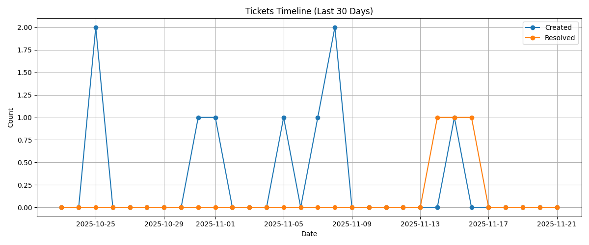
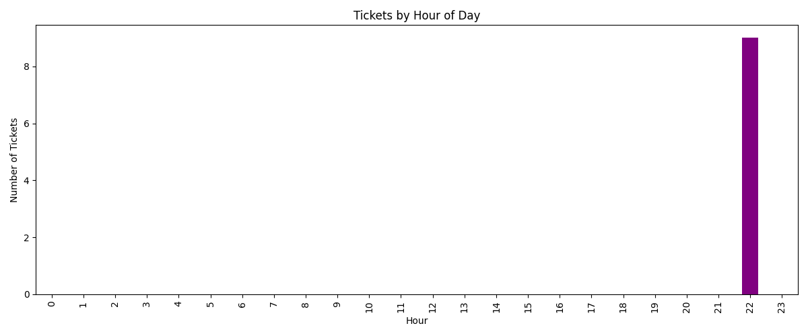
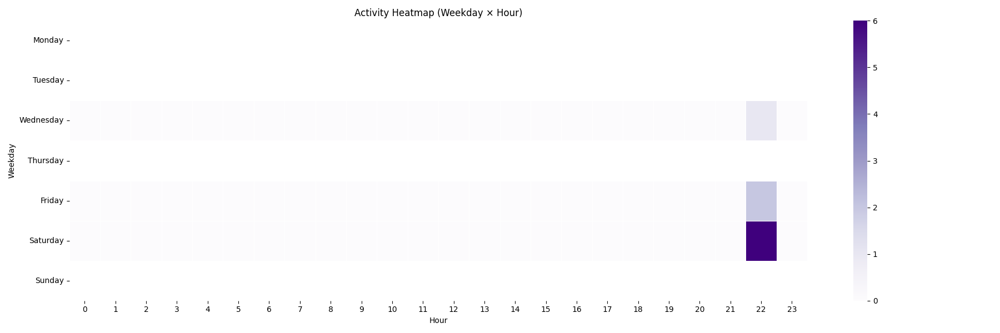
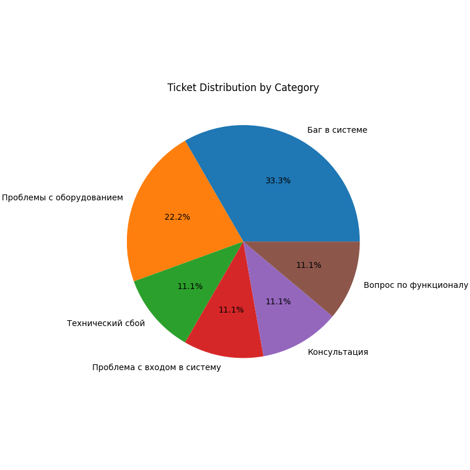
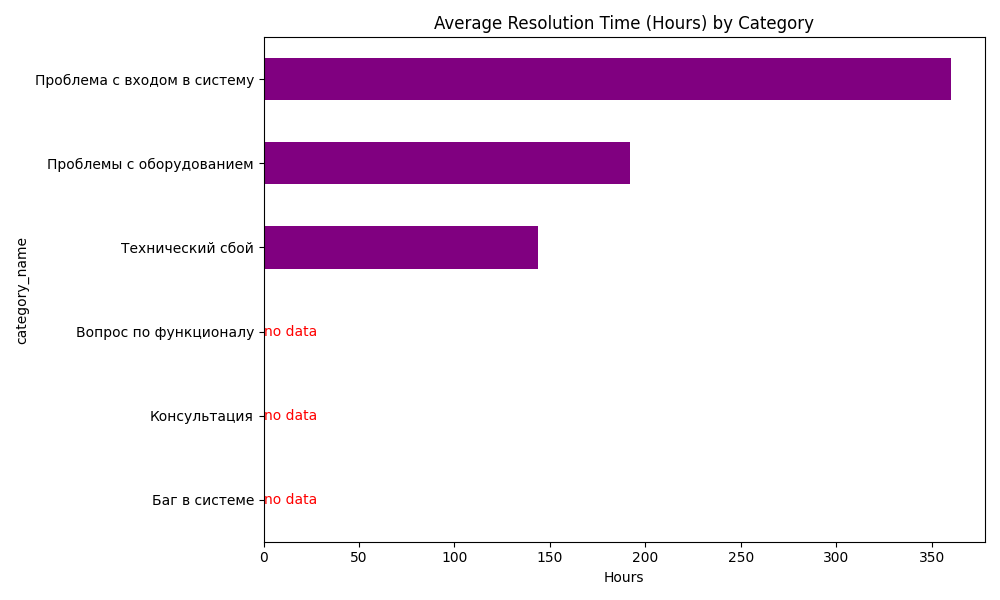
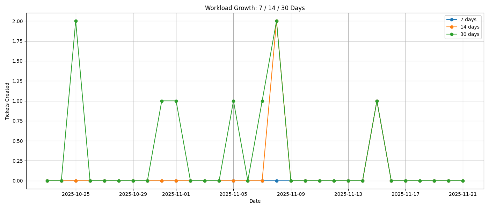

# Python_RK_2_IU8_BMSTU_2025
Вариант 5. 
---

**Отдел:**
Отдел разработки и внедрения

---

## Задание

Реализовать клиента, который реализует API запросы на сервер.

Постройте следующие графики:

- Линейный график: динамика создания тикетов по дням за последние 30 дней
- Столбчатая диаграмма: распределение тикетов по часам суток (когда чаще всего создаются обращения)
- Тепловая карта: активность по дням недели и часам

Создайте визуализации:

- Круговая диаграмма: распределение тикетов по категориям проблем
- Горизонтальная столбчатая диаграмма: среднее время решения (от created_at до closed_at) по каждой категории
- Таблица: топ-5 самых проблемных категорий по количеству тикетов

Постройте график роста нагрузки на отдел за 7/14/30 дней.
Логин: analyst_di
Пароль: LmN23vWx45Qr
Эндпоинт: GET /api/v1/timeline?days=30

---

## Технические зависимости

### Основные требования

```text
requests==2.32.5
pandas==2.3.2
numpy==2.3.3
matplotlib==3.10.6
seaborn==0.13.2
```
---

## Результат работы программы

```text
==============================
1) Downloading timeline data
==============================
[OK] Saved: output/timeline_linechart.png
Total tickets created in last 30 days: 9
Total tickets resolved in last 30 days: 3

==============================
2) Downloading tickets data
==============================
Total tickets assigned: 9
Unique categories: 6
Most active hour: 22:00
Most active weekday: Saturday

==============================
3) Running analytics & saving plots
==============================
[OK] Saved: output/tickets_by_hour.png
[OK] Saved: output/heatmap_weekday_hour.png
[OK] Saved: output/pie_categories.png
[OK] Saved: output/resolution_time_by_category.png
[OK] CSV saved: output/top5_categories.csv
[OK] Saved: output/workload_7_14_30.png

==============================
4) Statistics
==============================

Top-5 categories by number of tickets:
category_name
Баг в системе                  3
Проблемы с оборудованием       2
Технический сбой               1
Проблема с входом в систему    1
Консультация                   1

Average resolution time (hours) by category:
category_name
Технический сбой               144.0
Проблемы с оборудованием       192.0
Проблема с входом в систему    360.0

==============================
 WORKLOAD ANALYTICAL SUMMARY
==============================
Total tickets created in last 7 days:  1
Total tickets created in last 14 days: 3
Total tickets created in last 30 days: 9

Average tickets/day (7 days):  0.14
Average tickets/day (14 days): 0.21
Average tickets/day (30 days): 0.30

Change 7-14 days:  200.0%
Change 14-30 days: 200.0%


==============================
Completed successfully
==============================
```
---

## Выводы
1. Динамика создания тикетов по дням за последние 30 дней



График показывает динамику создания и закрытия тикетов за последние 30 дней, видно, что нагрузка на отдел нерегулярна. Создание тикетов происходит нестабильно: отдельные пики по 1–2 обращения в день, после которых снова идут периоды полного отсутствия активности. Всего тикетов создано 9 - за последние 30 дней.

2. Распределение тикетов по часам суток



Из графика видно, что активность сосредоточена в 22:00, где зафиксировано наибольшее количество созданных тикетов. 

3. Активность по дням недели и часам



Тепловая карта демонтрирует наибольший пик активности в субботу.

4. Распределение тикетов по категориям проблем



Диаграмма показывает, как распределяются заявки между различными категориями проблем. Больше всего обращений связано с багами в системе - треть всех тикетов. На втором месте - проблемы с оборудованием. Остальные категории - технические сбои, вопросы по функционалу, консультации и проблемы со входом - встречаются значительно реже и имеют одинаковую долю.

5. Среднее время решения по каждой категории



Из диаграммы видно, что максимальная длительность решения наблюдается у категории «Проблема с входом в систему». «Проблемы с оборудованием» и «Технический сбой» имеют умеренное среднее время обработки. Категории «Вопрос по функционалу», «Консультация» и «Баг в системе» отмечены как no data, поскольку среди текущих тикетов по ним отсутствуют завершённые случаи - незавершённость за анализируемый период.

6. Топ-5 самых проблемных категорий по количеству тикетов

Баг в системе,3
Проблемы с оборудованием,2
Технический сбой,1
Проблема с входом в систему,1
Консультация,1

На первом месте стоит «Баг в системе» - формирует наибольшее число тикетов, что указывает на необходимость приоритизации исправления системных ошибок. Далее идут «Проблемы с оборудованием», которые также встречаются достаточно часто. Остальные категории: «Технический сбой», «Проблема с входом в систему» и «Консультация» - появляются реже.

7. График роста нагрузки на отдел за 7/14/30 дней.



График показывает динамику роста нагрузки за 7, 14 и 30 дней. За последние 7 дней создан всего 1 тикет, что даёт в среднем 0.14 тикета в день, за 14 дней общее число - 3 тикета и среднее 0.21 в день, а за 30 дней - 9 тикетов при средней интенсивности 0.30 в день. Рост нагрузки: объём тикетов за последние 7 дней по сравнению с интервалом 14 дней увеличился на 200%, как и при сравнении 14-дневного и 30-дневного периодов.